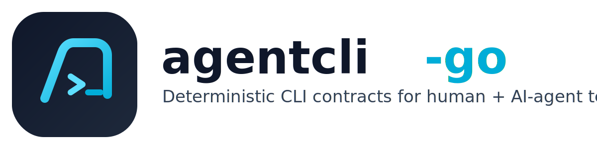

[](https://github.com/gh-xj/agentcli-go/actions/workflows/ci.yml)
[](https://github.com/gh-xj/agentcli-go/releases)
[](./LICENSE)
[](./go.mod)

<p align="center">
  
</p>

Harness engineering for Go CLIs: deterministic scaffolding, deterministic verification, deterministic evolution.

`agentcli-go` is a CLI framework plus a verification harness system.
It helps human + AI teams ship automation that stays contract-compliant over time.

---

# AgentCLI -GO

## Why AgentCLI -GO

- Build CLIs quickly with deterministic scaffold output
- Standardize verification with machine-readable contracts (`doctor --json`)
- Keep CI and local checks aligned with one harness contract (`task ci`)
- Enable human review with deterministic, machine-readable diagnostics

## Harness Engineering (Core Value)

`agentcli-go` is not just code generation. Its core value is harness engineering:

- deterministic scenario replay for onboarding and smoke validation
- explicit score gates (`0..10`, threshold-based pass/fail)
- role-based diagnostics when deeper analysis is needed
- drift prevention: schema checks + docs/help consistency checks

## Why This Beats Script-Based Workflows

Compared with ad-hoc Bash/Python scripts, `agentcli-go` gives you:

- compile-time safety instead of runtime surprises
- stable command contracts instead of implicit behavior drift
- deterministic verification (`task ci`, `task verify`) instead of best-effort checks
- measurable quality checks instead of ad-hoc fixes
- a repeatable project shape that agents and humans can both maintain

## Installation

### 1) Install with Go (Recommended)

```bash
go install github.com/gh-xj/agentcli-go/cmd/agentcli@v0.2.1
```

Add framework library dependency in your project:

```bash
go get github.com/gh-xj/agentcli-go@v0.2.1
```

### 2) Install with Homebrew

```bash
brew tap gh-xj/tap
brew install agentcli
```

### 3) Install Prebuilt Binary

Download from releases (macOS/Linux amd64+arm64):

- https://github.com/gh-xj/agentcli-go/releases/tag/v0.2.1

### Development Version

```bash
go install github.com/gh-xj/agentcli-go/cmd/agentcli@main
go get github.com/gh-xj/agentcli-go@main
```

## Install Verification

Check the binary is on PATH and runnable:

```bash
which agentcli
agentcli --version
agentcli --help
```

Expected result:

- `which` prints a valid path
- `--version` prints a semantic version or dev version
- `--help` exits successfully and shows command usage

## AI Prompt Starter

Copy-paste into your coding agent:

```text
You are helping me onboard to AgentCLI -GO.
Goal: create a deterministic Go CLI and keep it contract-compliant.

Do these steps in order and summarize outputs:
1) Install AgentCLI:
   go install github.com/gh-xj/agentcli-go/cmd/agentcli@v0.2.1
2) Familiarize with the CLI:
   agentcli --help
3) Verify binary and toolchain:
   which agentcli
   agentcli --version
4) agentcli new --module example.com/mycli mycli
5) agentcli add command --dir ./mycli --preset file-sync sync-data
6) agentcli doctor --dir ./mycli --json
7) cd mycli && task verify

If anything fails, fix root cause and re-run verification.
Do not skip contract checks.
```

## Quickstart

```bash
agentcli new --module example.com/mycli mycli
agentcli add command --dir ./mycli --preset file-sync sync-data
agentcli doctor --dir ./mycli --json
cd mycli
task verify
```

## First 5 Minutes

```bash
set -e

go install github.com/gh-xj/agentcli-go/cmd/agentcli@v0.2.1

mkdir -p /tmp/agentcli-demo && cd /tmp/agentcli-demo
agentcli --help
agentcli new --module example.com/demo demo
agentcli add command --dir ./demo --preset file-sync sync-data
agentcli doctor --dir ./demo --json
cd demo && task verify
```

## Core Capabilities

### Scaffold CLI

- `agentcli new`
- `agentcli add command`
- `agentcli doctor --json`

### Runtime Modules

- `cobrax`: standardized Cobra runtime + deterministic exit handling
- `configx`: deterministic config layering (`Defaults < File < Env < Flags`)

### Core Helpers

- logging: `InitLogger()`
- args: `ParseArgs`, `RequireArg`, `GetArg`, `HasFlag`
- exec: `RunCommand`, `RunOsascript`, `Which`, `CheckDependency`
- fs: `FileExists`, `EnsureDir`, `GetBaseName`
- runtime contracts: `NewAppContext`, `RunLifecycle`, `NewCLIError`, `ResolveExitCode`

## Verification Contract

Generated projects include:

- deterministic smoke artifact: `test/smoke/version.output.json`
- schema file: `test/smoke/version.schema.json`
- canonical gates: `fmt`, `lint`, `test`, `build`, `smoke`, `ci`, `verify`

This repository enforces output contracts using:

- `schemas/doctor-report.schema.json`
- `schemas/scaffold-version-output.schema.json`
- positive fixtures: `testdata/contracts/*.ok.json`
- negative fixtures: `testdata/contracts/*.bad-*.json`

## Examples

Runnable examples:

- [`examples/file-sync-cli`](./examples/file-sync-cli)
- [`examples/http-client-cli`](./examples/http-client-cli)
- [`examples/deploy-helper-cli`](./examples/deploy-helper-cli)

Examples index: [`examples/README.md`](./examples/README.md)

## Documentation

Simple docs entry points:

- https://gh-xj.github.io/agentcli-go/
- [`skills/verification-loop/SKILL.md`](./skills/verification-loop/SKILL.md)
- [`docs/site/index.md`](./docs/site/index.md)
- [`docs/site/getting-started.md`](./docs/site/getting-started.md)
- [`docs/site/ai-agent-playbook.md`](./docs/site/ai-agent-playbook.md)

## Project Health

- License: [Apache-2.0](./LICENSE)
- Security policy: [SECURITY.md](./SECURITY.md)
- Contribution guide: [CONTRIBUTING.md](./CONTRIBUTING.md)
- Code of Conduct: [CODE_OF_CONDUCT.md](./CODE_OF_CONDUCT.md)
- Changelog: [CHANGELOG.md](./CHANGELOG.md)

## Contributing

Before opening a PR:

1. Keep scaffold/runtime behavior deterministic.
2. Update schema fixtures when output contracts change.
3. Run `task ci`.

Recommended local guardrails:

- `task hygiene` to catch junk files, leaked keys/tokens, and history artifacts
- `task hooks:install` to enable pre-commit hygiene checks
- `task lint:strict` for stricter advisory linting before release/major refactors

Automation:

- CI uses Go module/build cache via `actions/setup-go`.
- Weekly remote merged-branch cleanup workflow:
  `.github/workflows/branch-cleanup.yml`
